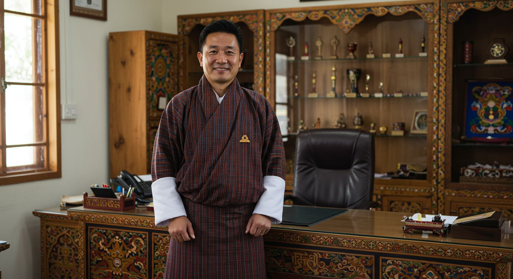

# ZorigHub: Product Requirements Document

## Project Overview

**Project Name:** ZorigHub

**Version:** 1.0

**Date:** 2025-06-12

### Original Requirements

ZorigHub is a digital platform that empowers Bhutanese youth artisans skilled in traditional crafts such as weaving, carving, and painting. The platform offers verified skills certification, eco-friendly packaging solutions, and access to global and tourism-focused markets. By integrating with existing handicraft associations, ZorigHub supports job creation, promotes sustainable livelihoods, and preserves Bhutan's cultural heritage. It blends technology with tradition to help young artisans thrive in a modern economy while staying rooted in their identity.

Core functionalities include:

1. Artisan profile management
2. Verified skills certification portal
3. Digital marketplace/e-commerce platform
4. Tourism-focused features
5. Integrated eco-friendly packaging solutions
6. Admin dashboard
7. Analytics and reporting

## Product Definition

### Product Goals

1. **Artisan Empowerment:** Create sustainable economic opportunities for Bhutanese youth artisans by connecting them directly with global markets and validating their traditional craft skills.

2. **Cultural Heritage Preservation:** Safeguard and promote Bhutan's rich cultural heritage by documenting traditional crafts and creating incentives for young artisans to continue these practices.

3. **Sustainable Development:** Support environmentally responsible practices throughout the handicraft value chain while generating positive social impact aligned with Bhutan's Gross National Happiness philosophy.

### User Stories

1. **As a young Bhutanese weaver**, I want to showcase my traditional textiles to international customers so that I can earn a sustainable income while practicing my cultural heritage.

2. **As a handicraft association representative**, I want to verify and certify the skill levels of artisans so that buyers can trust the authenticity and quality of their crafts.

3. **As an international tourist**, I want to purchase authentic Bhutanese handicrafts directly from artisans so that I can bring home meaningful souvenirs with cultural significance.

4. **As a tour operator**, I want to connect my clients with authentic craft experiences so that I can enhance their cultural immersion in Bhutan.

5. **As a platform administrator**, I want to access detailed analytics on platform performance so that I can improve features and demonstrate impact to stakeholders.

### Competitive Analysis

#### Key Competitors

| Platform                                             | Pros                                                                                                                                                                                                      | Cons                                                                                                                                                                 |
| ---------------------------------------------------- | --------------------------------------------------------------------------------------------------------------------------------------------------------------------------------------------------------- | -------------------------------------------------------------------------------------------------------------------------------------------------------------------- |
| **Etsy**                                             | - Established global marketplace with 446M monthly visits - Low barrier to entry with simple onboarding - Strong community features - Lower fees (6.5% transaction fee) - Brand customization | - Oversaturated marketplace - Limited regional focus - No artisan verification system - No tourism-specific features - Limited cultural heritage context |
| **Amazon Handmade**                                  | - Massive reach (2.2B monthly visits) - Integration with Amazon Prime - Fulfillment infrastructure - No listing expiration                                                                       | - High fees (15% referral fee) - Less storefront customization - Less community focus - Limited cultural context - Generic marketplace experience        |
| **Novica**                                           | - Fair trade focus - Artisan stories highlighted - Regional categorization - Direct artisan support model                                                                                        | - Limited market reach - Less robust technology - Limited verification process - No comprehensive packaging solutions                                       |
| **Ten Thousand Villages**                            | - Strong ethical positioning - Cultural education component - Fair trade certified - Physical retail presence                                                                                    | - Limited digital features - Small online presence - No skills certification - Limited customization                                                        |
| **Agency for Promotion of Indigenous Crafts (APIC)** | - Bhutan-specific focus - Government backing - Cultural authenticity - Local market knowledge                                                                                                    | - Limited technology integration - Minimal global reach - Basic e-commerce capabilities - Limited youth focus                                               |
| **Handicrafts Association of Bhutan**                | - Strong local network - Authentic certification - Direct artisan connections - Cultural expertise                                                                                               | - Limited digital presence - Minimal e-commerce capability - Limited market expansion - Traditional business model                                          |

### User Personas

#### Karma (Young Bhutanese Artisan)

  

- **Demographics:** 24-year-old, rural background, trained in traditional weaving
- **Goals:** Earn sustainable income, preserve family craft traditions, reach new markets
- **Frustrations:** Limited market access, difficulty competing with imports, lack of recognition
- **Motivations:** Cultural pride, economic independence, skill development
- **Tech Comfort:** Moderate - uses smartphone daily but has limited e-commerce experience

#### Kevin (International Tourist/Buyer)

  

- **Demographics:** 38-year-old professional from the US, culturally conscious traveler
- **Goals:** Find authentic Bhutanese crafts, connect with local culture, support local artisans
- **Frustrations:** Difficulty verifying authenticity, limited pre-trip purchase options, concerns about exploitation
- **Motivations:** Cultural appreciation, ethical consumption, unique high-quality items
- **Tech Comfort:** High - regularly shops online and uses travel apps

#### Tshering (Handicraft Association Representative)

  

- **Demographics:** 45-year-old, mid-level manager at a regional handicraft association
- **Goals:** Support member artisans, preserve traditional techniques, ensure quality standards
- **Frustrations:** Limited resources for certification, difficulty connecting artisans to markets
- **Motivations:** Cultural preservation, community development, quality assurance
- **Tech Comfort:** Low to moderate - uses basic digital tools but less familiar with advanced platforms

#### Platform Admin

- **Demographics:** 35-year-old technology professional with experience in e-commerce
- **Goals:** Ensure platform success, generate impact data, facilitate connections
- **Frustrations:** Limited resources, balancing technology with traditional practices
- **Motivations:** Social impact, economic development, cultural preservation
- **Tech Comfort:** High - experienced with digital platforms and analytics

## Technical Specifications

### Requirements Analysis

ZorigHub aims to bridge the gap between traditional Bhutanese craftsmanship and global digital commerce by providing a specialized platform that addresses the unique needs of young artisans, craft associations, and international buyers. The platform must balance several key considerations:

1. **Cultural Authenticity vs. Global Accessibility:** Maintain the integrity of Bhutanese craft traditions while making products accessible to international markets.

2. **Technical Sophistication vs. Ease of Use:** Provide robust features while remaining accessible to artisans with varied levels of digital literacy.

3. **Quality Verification vs. Inclusive Participation:** Ensure product authenticity and quality through verification processes without creating barriers to entry for young artisans.

4. **Traditional Practices vs. Modern E-commerce:** Honor traditional crafting and business practices while implementing contemporary e-commerce functionality.

5. **Local Integration vs. Independent Platform:** Complement existing handicraft associations and government initiatives while providing independent value.

### Requirements Pool

#### P0 (Must Have)

1. **Artisan Profile System**

   - User registration and authentication
   - Comprehensive profile creation with portfolio capabilities
   - Skills and specialty tagging
   - Artisan story and cultural context sharing
   - Contact information and communication tools

2. **Skills Certification Module**

   - Credential submission workflow
   - Association review and approval process
   - Digital certificate generation and display
   - Verification badge system
   - Renewal and upgrade pathways

3. **E-commerce Fundamentals**

   - Product listing and management
   - Secure payment processing (local and international)
   - Order management system
   - Basic inventory tracking
   - Shipping integration

4. **Admin Dashboard**
   - User management
   - Content moderation
   - Basic analytics and reporting
   - Platform configuration
   - Support ticket system

#### P1 (Should Have)

1. **Tourism-Focused Features**

   - Special collections for tourists
   - Cultural context enhancement for products
   - Multi-language support
   - Pre/post-visit purchasing options
   - Integration with tourism providers

2. **Eco-Friendly Packaging Integration**

   - Sustainable packaging options catalog
   - Packaging selection during fulfillment
   - Eco-credentials display
   - Cost integration with order processing

3. **Enhanced Analytics**

   - Artisan performance dashboards
   - Market trend analysis
   - Customer behavior insights
   - Impact metrics tracking
   - Association-level reporting

4. **Mobile Responsiveness**
   - Progressive web application
   - Simplified mobile workflows
   - Offline capabilities for rural areas
   - Mobile notification system

#### P2 (Nice to Have)

1. **Advanced Features**

   - Virtual/augmented reality product previews
   - Live streaming craft demonstrations
   - Blockchain-based authentication
   - Artisan mentorship program
   - Crowdfunding for workshop improvements

2. **Integration Capabilities**

   - API for third-party applications
   - Integration with government tourism portals
   - Social media cross-posting
   - Museum and cultural institution partnerships
   - Global craft marketplace partnerships

3. **Community Features**
   - Artisan forums and communication tools
   - Knowledge sharing platform
   - Collaborative project capabilities
   - Cultural event calendar
   - Educational resources

### UI Design Draft

#### Navigation Structure

#### Key Interface Sketches

1. **Homepage**

   - Hero section with rotating featured artisans and their stories
   - Category navigation with visual representation of craft types
   - Tourist-specific entry point highlighting authentic experiences
   - Latest collections and seasonal highlights
   - Impact metrics showing platform achievements

2. **Artisan Profile Page**

   - Prominent profile photo and biographical story
   - Craft specialty and verification badges
   - Portfolio gallery with high-quality images
   - Cultural context of the artisan's work
   - Product listings with detailed descriptions
   - Contact/commission request options

3. **Skills Certification Portal**

   - Step-by-step application process
   - Credential upload functionality
   - Status tracking interface
   - Digital certificate display
   - Renewal notifications

4. **Product Listing Page**

   - Multiple product images from different angles
   - Detailed description including materials, techniques, and cultural significance
   - Pricing and availability information
   - Eco-friendly packaging options
   - Shipping estimates and options
   - Related products and artisan information

5. **Admin Dashboard**
   - Key performance indicators at a glance
   - User management tools
   - Content moderation queue
   - System configuration options
   - Analytics and reporting interface

### Open Questions

1. **Partnership Structure**

   - What is the exact relationship between ZorigHub and existing handicraft associations? Will formal agreements be needed?
   - How will the platform coordinate with government tourism initiatives and integrate with their marketing efforts?

2. **Certification Standards**

   - What specific criteria will be used for skills certification across different craft types?
   - Who will be the authoritative body for certification approval? Individual associations or a central committee?
   - What will be the renewal process and frequency for certifications?

3. **Financial Model**

   - What fee structure will be sustainable while remaining accessible to young artisans?
   - Will there be tiered membership models or uniform transaction fees?
   - How will payment processing work given Bhutan's banking infrastructure limitations?

4. **Logistics and Fulfillment**

   - How will shipping be managed for international orders, especially from remote areas?
   - What partners will provide the eco-friendly packaging solutions?
   - Will there be centralized shipping options or will individual artisans manage their fulfillment?

5. **Technical Implementation**
   - What level of offline functionality is required given internet connectivity challenges in rural Bhutan?
   - How will the platform handle multiple languages and currencies?
   - What security measures will be implemented to protect both buyers and artisans?

## Success Metrics

### Impact Metrics

1. **Artisan Empowerment Metrics**

   - Number of active artisans on the platform
   - Average income generated per artisan
   - Percentage increase in artisan earnings compared to pre-platform baseline
   - Number of youth artisans (18-35) maintaining traditional crafts as primary income
   - Skills development progression (certification levels achieved)

2. **Cultural Heritage Preservation Metrics**

   - Number of traditional techniques documented on the platform
   - Diversity of craft types represented
   - Number of educational content pieces about Bhutanese crafts
   - Percentage of endangered craft techniques that have active practitioners

3. **Sustainable Development Metrics**
   - Percentage of orders using eco-friendly packaging
   - Carbon footprint reduction through sustainable practices
   - Rural economic development statistics (geographic distribution of artisans)
   - Alignment with Gross National Happiness indicators

### Platform Performance Metrics

1. **Marketplace Metrics**

   - Gross merchandise value (GMV)
   - Average order value
   - Conversion rate
   - Customer retention rate
   - Inventory turnover

2. **User Engagement Metrics**

   - Monthly active users
   - Session duration
   - Repeat purchase rate
   - Artisan profile completion rate
   - Tourist-specific engagement metrics

3. **Technical Performance Metrics**
   - Platform uptime
   - Page load times (especially in areas with limited connectivity)
   - Mobile vs. desktop usage
   - User satisfaction scores

## Implementation Roadmap

### Phase 1: Foundation (3 months)

- Core platform development with basic profile and e-commerce functionality
- Integration with initial handicraft associations for certification
- Onboarding of 50-100 pilot artisans
- Basic payment processing and fulfillment systems

### Phase 2: Expansion (6 months)

- Tourism-focused features implementation
- Eco-friendly packaging integration
- Enhanced analytics and reporting
- Marketing campaign to increase international visibility
- Expansion to 250+ artisans

### Phase 3: Optimization (Ongoing)

- Advanced features based on user feedback
- Additional integration capabilities
- Community features development
- Continuous improvement based on performance metrics

## Conclusion

ZorigHub represents a unique opportunity to bridge traditional Bhutanese craftsmanship with global digital commerce, creating sustainable livelihoods for young artisans while preserving cultural heritage. By focusing on the distinctive elements of skills certification, cultural context, tourism integration, and eco-friendly practices, the platform can differentiate itself from generic marketplaces while creating meaningful social and economic impact.

The success of ZorigHub will be measured not only in commercial terms but also in its contribution to Bhutan's cultural resilience and sustainable development goals. By empowering youth artisans to maintain traditional practices within a contemporary economic framework, ZorigHub supports the delicate balance between modernization and cultural preservation that is central to Bhutan's development philosophy.

Through careful implementation and partnership with existing stakeholders, ZorigHub can become a model for culturally-sensitive digital transformation in traditional craft economies worldwide.

## System Design

[📄 View System Design Documentation](./docs/systemdesign.md)
